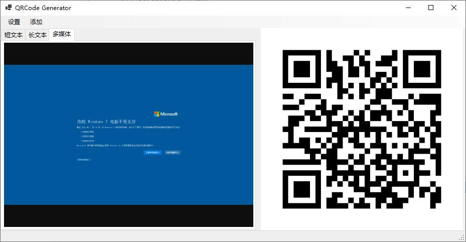

# QRCode Generator

## 介绍
一个简易的二维码生成器，支持将文字、图片、音频、视频等内容转换为二维码，便于实现远程数据传输。

## 截图
  
  

## 功能特性
- **文本转二维码**：支持将文本直接转换为二维码。
- **内网URL生成**：生成内网URL，内网设备可以通过该URL访问数据。
- **内网穿透支持**：提供内网穿透功能，使外网设备也能访问数据。
- **长文本加密传输**：对长文本进行加密，保障数据安全。

## 已知问题
部分媒体格式因浏览器兼容性问题（缺少解码器）无法在软件内预览。受影响的格式包括但不限于：MP4、M4A、AVI、MKV（可以通过外部浏览器播放）。常见的编码格式如 AAC 和 H.264 可能存在不支持的情况。